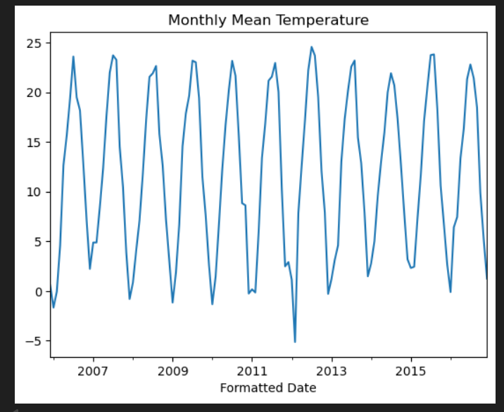
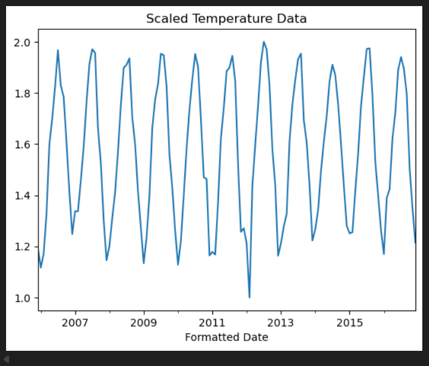
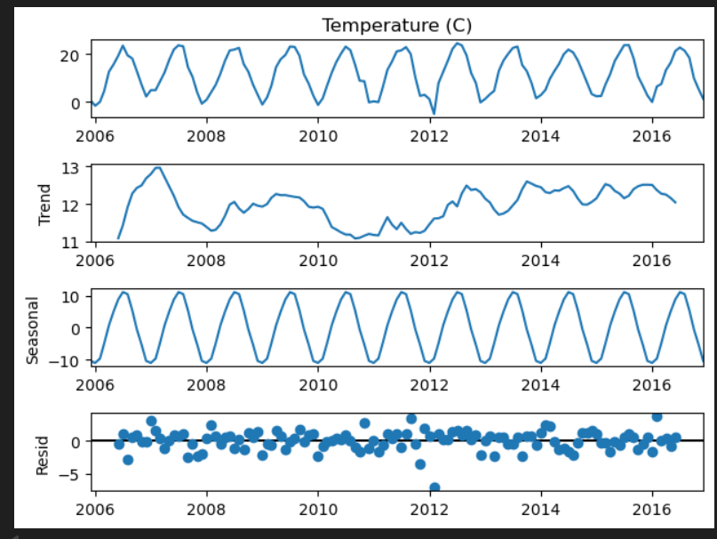
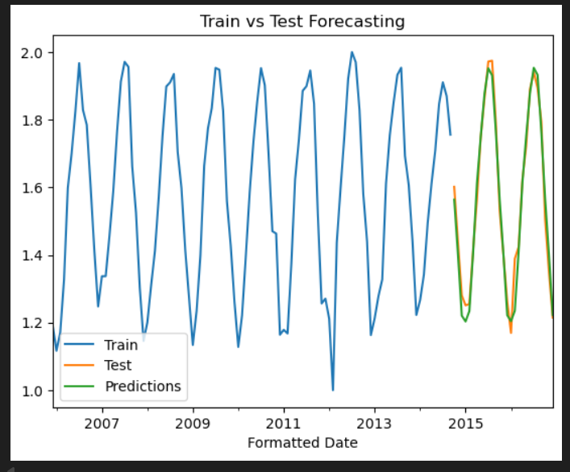
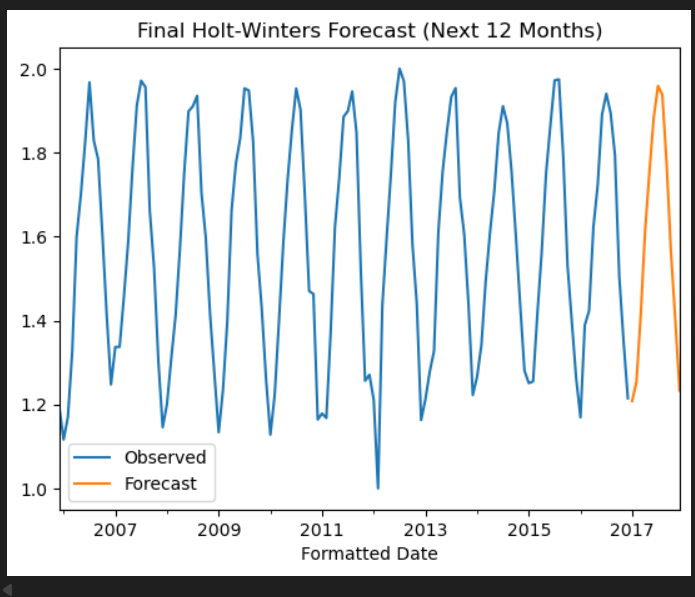
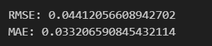

# EXP 6: Holt-Winters Method Implementation

## Date: 26-09-2025

## **Aim**

To apply the Holt-Winters exponential smoothing method for time series forecasting of **monthly mean temperature** using the `weatherHistory.csv` dataset. The goal is to analyze seasonality, trend, and level components and forecast future temperature values.

---

## **Algorithm**

1. **Import Libraries**
   Load required libraries: pandas, numpy, matplotlib, statsmodels, sklearn.

2. **Load Dataset**

   * Read `weatherHistory.csv`.
   * Convert `Formatted Date` column to datetime.
   * Set datetime as the index.

3. **Preprocessing**

   * Resample the dataset to **monthly mean temperature** (`MS`).
   * Scale values using **MinMaxScaler** to stabilize the model (shift to positive values).

4. **Seasonal Decomposition**

   * Apply `seasonal_decompose` with additive model and period = 12 months.
   * Plot **trend, seasonality, and residuals**.

5. **Train-Test Split**

   * Split the dataset into 80% training and 20% testing.

6. **Model Training**

   * Use **ExponentialSmoothing** with:

     * `trend='add'` (additive trend)
     * `seasonal='mul'` (multiplicative seasonality)
     * `seasonal_periods=12` (yearly seasonality)
   * Fit the model on training data.

7. **Model Evaluation**

   * Forecast values for the test set.
   * Plot **train, test, and predictions**.
   * Compute error metrics: **RMSE, MAE**.

8. **Final Forecasting**

   * Train model on full dataset.
   * Forecast **next 12 months**.
   * Plot final forecast results.

---

## **Program:**


```python
import pandas as pd
import numpy as np
import matplotlib.pyplot as plt
from statsmodels.tsa.holtwinters import ExponentialSmoothing
from sklearn.preprocessing import MinMaxScaler
from sklearn.metrics import mean_absolute_error, mean_squared_error
from statsmodels.tsa.seasonal import seasonal_decompose

# Load dataset
data = pd.read_csv("weatherHistory.csv")

# Parse datetime column
data['Formatted Date'] = pd.to_datetime(data['Formatted Date'], utc=True, errors='coerce')
data = data.set_index('Formatted Date')

# Resample to monthly mean
data_monthly = data['Temperature (C)'].resample('MS').mean()

# Scaling
scaler = MinMaxScaler()
scaled_data = pd.Series(
    scaler.fit_transform(data_monthly.values.reshape(-1, 1)).flatten(),
    index=data_monthly.index
)
scaled_data = scaled_data + 1

# Seasonal decomposition
decomposition = seasonal_decompose(data_monthly, model="additive", period=12)
decomposition.plot()
plt.show()

# Train-test split
train_size = int(len(scaled_data) * 0.8)
train_data = scaled_data[:train_size]
test_data = scaled_data[train_size:]

# Holt-Winters Model
model_add = ExponentialSmoothing(train_data, trend='add', seasonal='mul', seasonal_periods=12).fit()
test_predictions = model_add.forecast(steps=len(test_data))

# Visual evaluation
ax = train_data.plot(label="Train")
test_data.plot(ax=ax, label="Test")
test_predictions.plot(ax=ax, label="Predictions")
ax.legend()
ax.set_title("Train vs Test Forecasting")
plt.show()

# Error metrics
rmse = np.sqrt(mean_squared_error(test_data, test_predictions))
mae = mean_absolute_error(test_data, test_predictions)
print("RMSE:", rmse)
print("MAE:", mae)

# Final model
final_model = ExponentialSmoothing(scaled_data, trend='add', seasonal='mul', seasonal_periods=12).fit()
final_predictions = final_model.forecast(steps=12)

# Final forecast plot
ax = scaled_data.plot(label="Observed")
final_predictions.plot(ax=ax, label="Forecast")
ax.legend()
ax.set_title("Final Holt-Winters Forecast (Next 12 Months)")
plt.show()
```

---

## **Expected Output/Graphs**

## Line plot of **monthly average temperature**.



## Scaled data plot.



## Seasonal decomposition plots (Trend, Seasonality, Residuals).



## Train vs Test with predictions.



## Final 12-month forecast.



## Error metrics: **RMSE and MAE** values printed.


---

## **Result**

The Holt-Winters method successfully captured the **trend and seasonal pattern** of monthly mean temperature.

* The RMSE and MAE values indicate the accuracy of the model.
* The final 12-month forecast shows the expected seasonal fluctuations in temperature.
* This method is effective for **seasonal time series forecasting** such as weather, sales, or energy consumption.


